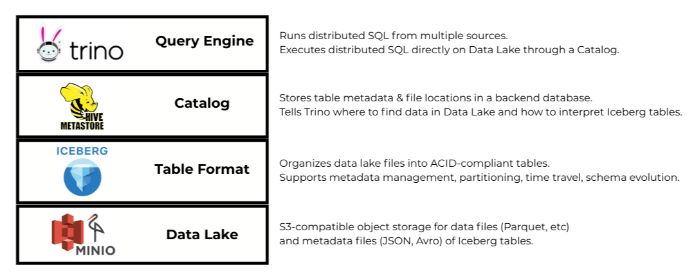
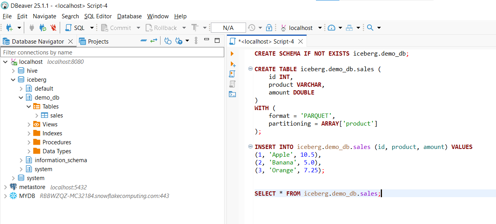
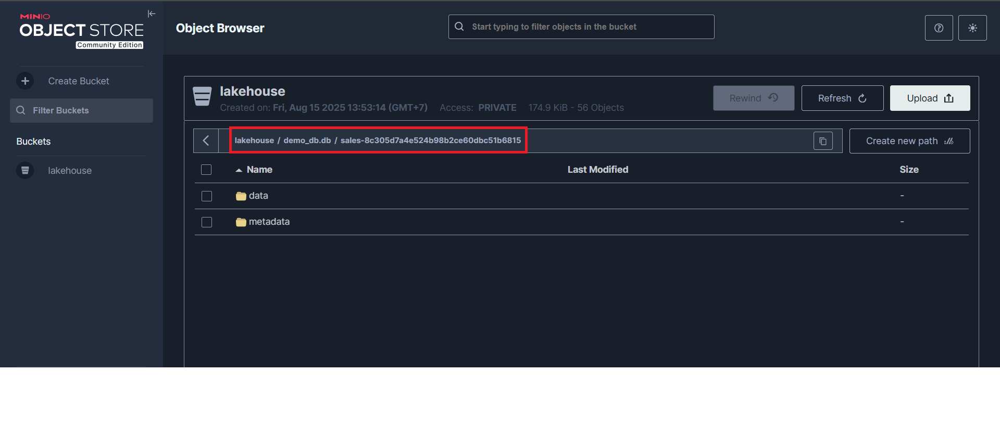

# 📑 Table of Contents

- [📌 1. Introduction](#-1-introduction)
- [🏗 2. Architecture](#-2-architecture)
- [📂 3. Project Structure](#-3-project-structure)
- [🚀 4. Setup](#-4-setup)

---

# 📌 1. Introduction
This project's still ongoing.

---

# 🏗 2. Architecture

## 2.1 Lakehouse



**Test creating a table using Trino in DBeaver:**



**Check the result on MinIO:**



## 2.2 Pipeline


---

# 📂 3. Project Structure
```text
stream-pipeline-via-lakehouse/
│
├── init/                              # Initialization scripts
├── hive/                              # Hive metastore configuration + Dockerfile
├── trino/                             # Trino configuration
├── spark/                             # Spark configuration + Dockerfile
├── superset/                          # Superset configuration + Dockerfile
│
├── src/                               # ETL source code following the medallion architecture
│   ├── bronze/                          # Bronze layer – raw ingested data from Kafka
│   ├── silver/                          # Silver layer – cleaned, standardized, and enriched data
│   ├── gold/                            # Gold layer – aggregated, analytics-ready data for BI/ML
│   └── ...                           
│
├── readme/                            # Documentation, diagrams, notes
│
├── docker-compose-lakehouse.yml       # Docker Compose for the Lakehouse stack (MinIO, Hive, Postgres, Trino), and Superset
├── docker-compose-spark.yml           # Docker Compose for Spark cluster
└── docker-compose-kafka.yml           # Docker Compose for Kafka cluster, and Kafka UI

```

---

# 🚀 4. Setup

## 4.1 Prerequisites

Before starting, please ensure you have:

- Docker Desktop installed and running.
- VS Code installed to open project.
- DBeaver installed to connect to Trino to write SQL.

## 4.2 Setup & Initialization
**Step 1:** Before running the pipeline, make sure `make` is installed. On Windows, you install Chocolatey first and then install Make:
```powershell
# Install Chocolatey (run in PowerShell as Administrator)
Set-ExecutionPolicy Bypass -Scope Process -Force; [System.Net.ServicePointManager]::SecurityProtocol = [System.Net.ServicePointManager]::SecurityProtocol -bor 3072; iex ((New-Object System.Net.WebClient).DownloadString('https://community.chocolatey.org/install.ps1'))
# Upgrade Chocolatey (optional but recommended)
choco upgrade chocolatey
# Install Make
choco install make
# Verify installation
make --version
```

**Step 2:** Install Hadoop & Hive to set up Hive Metastore:
```bash
# Navigate to hive/jars folder
cd hive/jars
# Run Makefile to install
make download
```

**Step 3:** Set up the whole architecture through Docker:
```bash
# Create a Docker network "common-net" for all services to communicate with each other
docker network create common-net
# Start all services (download if needed) using Makefile
make all-up
```

## 4.3 Service Access
### Web UI
- **MinIO UI:** http://localhost:9001
  - User: minio
  - Password: minio123
- **Superset UI:** http://localhost:8088
  - User: superset
  - Password: superset
- **Trino UI:** http://localhost:8080
  - User: trino
  - Password: 
- **Kafka UI:** http://localhost:8081
- **Spark Master UI:** http://localhost:8082
- **Spark Worker 1 UI:** http://localhost:8083

### Database / SQL Client
- **Postgres:** localhost:5432 (connect via DBeaver)
  - User: hive
  - Password: hive
  - Database: metastore
- **Trino:** localhost:8080 (connect via DBeaver)
  - User: trino
  - Password:

## 4.4 Run the pipeline
